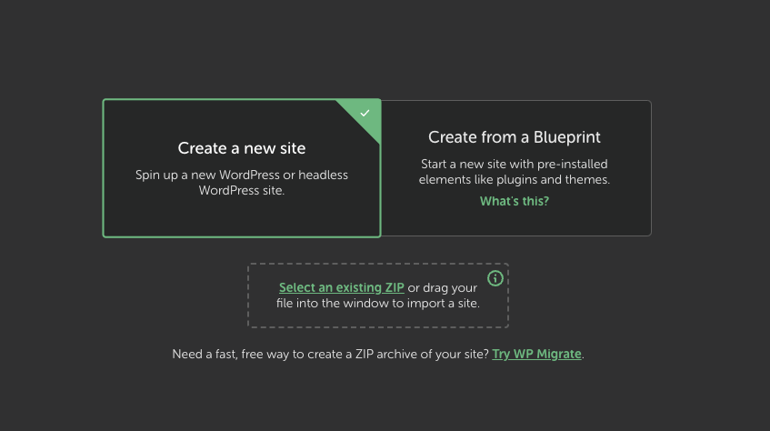
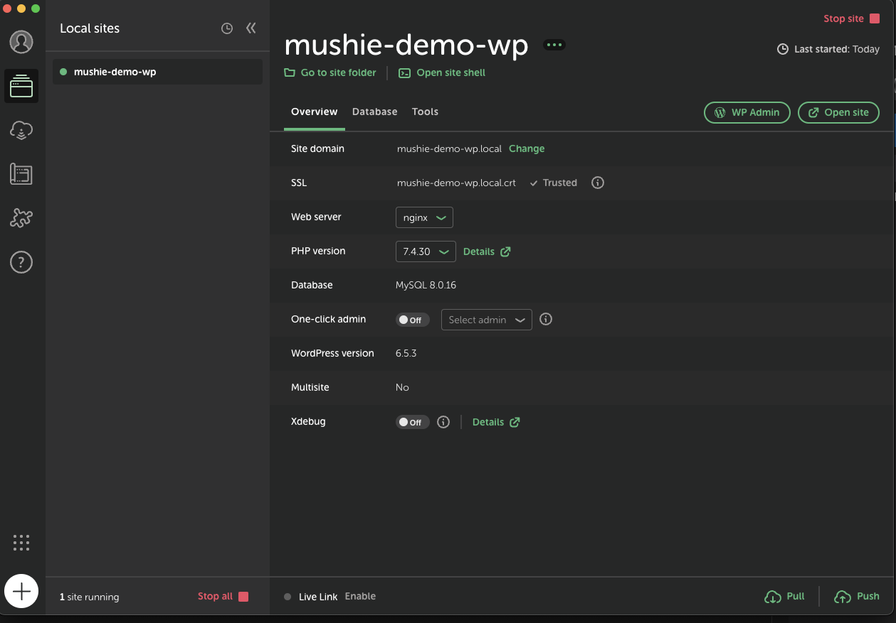
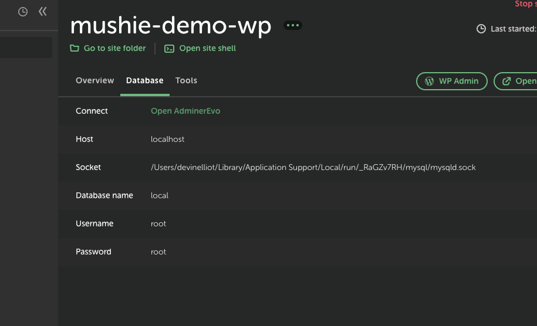
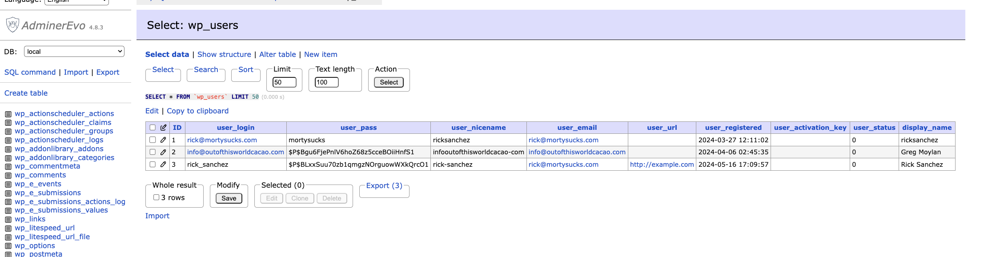

# Local Server Setup and Environments for WordPress Project

## Prerequisites

- PHP: Download and install PHP
- Local by Flywheel: Download and install [Local.](https://localwp.com/)
- Composer: Download and install [Composer](https://getcomposer.org/download/)
- Cursor: Download and install [Cursor](https://cursor.sh/).

* Embrace the 🤖 overloards

## Steps

### 1. Get the project in format for Local

Get a .zip of the project, you'll need it to upload the project to Local since it doesn't seem to have a direct path to git for version control \*it does have an integration for github actions

```
curl -L -o repo.zip https://github.com/username/repository/archive/refs/heads/main.zip
```

Local will create a `Local Sites` directory somewhere on your machine, this is where you'll find the project. From here you can setup git and connect the project to the repo here:

```
git clone git@github.com:newdaojones/mushie-demo-wp.git
```

- I don't see a way to do this normally and I'm done php spelunking

### 2. Setup Local Environment

1. Open Local and create a upload the .zip file:



2. Configure local domains



- Local says SSL is set for the local environment but I get an error from the payment_fields for the credit card that says the site is not secure. 🤷🏼

### 3. Install Packages

From the root of the project run the following commands:

```
composer install
```

Our plugins are installed via composer, this will install them. When you make changes to them you'll need to run:

```
composer update
```

### 4. Databases

The database data is in the zip that's been uploaded to Local. You can access the GUI for the database here:



- You may need to lookup the wp_user table to get credentials or reset them as the case may be for the WP Admin user access



### 5. Start Local Site

Start the site from Local and access it via the provided local URL.

### 6. WP Admin

Start the WP Admin from Local. You'll need access credentials to get in which can found in the above screenshot.

- There's something off about which name the admin field is using, it gives an option for email or username but I MUST use username

`rick_sanchez`
`mortysucks`

If this doesn't work I've only had success adding a new user. You can't just dump the db or you will dump then entire site. Tell me if there is a smarter way to do this.

### 10. Verify Setup

Access the local site and verify everything is working correctly.

---

# Custom Payment Gateway Plugin(s)

Where to find them in the project

```
path: `/app/public/wp-content/plugins/custom-payment-gateway.php`
path: `/app/public/wp-content/plugins/my-custom-features.php`
```

### Branch: Main

The basic omni widget but refactored for readability and error handling

- loads it's own payment page
- uses iframe
- requires a customer URL provided by OMNI in the setup instructions -> we're the customer in this case

### Branch: improv/ux-improvements

This improvement is aimed at moving the payment fields into the checkout page so that the user can more quickly complete their checkout process. This is driven by the customer conversion difference provided by Customer 2.

- payment page has been removed
- payment_form() utility moved from my-custom-features.php to payment_fields() in custom-payment-gateway.php
- some validation but its questionable

Current status

- I think it's ready for worldpay integration
- I haven't looked at that at all yet
- GPT seems pretty on point with the code so far 👍🏻
